# **!**[**SCCM on Hyper-V Setup Demo**](**sccm-on_hyper-v.gif**)

# 🖥️ SCCM on Hyper-V Setup Guide & Interactive Checklist

<div align="center">

[](https://opensource.org/licenses/MIT)
[]()
[]()
[]()

*Complete step-by-step guide with interactive checklist for setting up Microsoft System Center Configuration Manager (SCCM) on a workstation using Hyper-V virtualization.*

</div>

---

## ✨ Overview

This repository provides a comprehensive guide for setting up a complete SCCM lab environment on your workstation using Hyper-V. The setup includes everything from the foundational Active Directory domain controller to a fully functional SCCM primary site, perfect for learning, testing, and developing enterprise management solutions.

> **Built with modern design principles** - sleek, elegant, and minimalist interface that represents professional excellence.

## 🎯 Features

### 📖 **Comprehensive Guide**

- **Complete infrastructure setup** including domain controller, DNS, DHCP, and SQL Server
- **Production-like configuration** that mirrors enterprise deployments
- **Isolated lab environment** using Hyper-V internal networking
- **Scalable design** allowing you to add more VMs for testing

### 🎨 **Interactive Checklist**

- **✅ Modern UI/UX** with glassmorphism effects and smooth animations
- **🌙 Dark theme** optimized for extended use
- **💾 Auto-save functionality** - never lose your progress
- **📊 Real-time progress tracking** with elegant visual indicators
- **🔄 Collapsible sections** for streamlined navigation
- **📱 Responsive design** that works flawlessly on any device
- **📄 Professional export capabilities** for progress reports
- **🖨️ Print-optimized layout**

## 🚀 Quick Start

### **Prerequisites**

```yaml
Hardware Requirements:
  RAM: 16GB minimum (32GB+ recommended)
  Storage: 500GB+ available space
  CPU: Intel VT-x or AMD-V support
  OS: Windows 10/11 Pro or Enterprise

Software Stack:
  - Windows Server 2019/2022 ISO
  - SQL Server 2022 Developer Edition (FREE)
  - SCCM Current Branch
  - Windows ADK for Windows 11 v22H2
  - Windows PE add-on for ADK
```

### **Installation**

```bash
# Clone the repository
git clone https://github.com/m4cd4r4/sccm-hyperv-setup.git

# Navigate to project
cd sccm-hyperv-setup

# Open the interactive checklist
open sccm-setup-checklist.html
```

## 📁 **Repository Structure**

```
sccm-hyperv-setup/
├── 📄 README.md                          # You are here
├── 🌐 sccm-setup-checklist.html         # Interactive checklist
├── 📚 docs/
│   ├── 📖 detailed-guide.md             # Complete step-by-step guide
│   ├── 🔧 troubleshooting.md            # Common issues & solutions
│   └── ⚙️  advanced-configuration.md     # Post-installation features
└── 🎨 assets/
    ├── 🏗️  architecture-diagram.png      # Lab architecture overview
    └── 📸 screenshots/                  # Visual step-by-step guide
```

## 🏗️ **Lab Architecture**

```mermaid
graph TB
    Host[🖥️ Host Workstation<br/>Windows 10/11 Pro]
  
    subgraph "🌐 Hyper-V Virtual Network"
        DC[🏢 DC01-SCCM<br/>Domain Controller<br/>192.168.137.10]
        SCCM[⚙️ SCCM01<br/>SCCM + SQL Server<br/>192.168.137.20]
        Client[💻 Test Client<br/>Windows 10/11<br/>DHCP Assigned]
    end
  
    Host --> DC
    Host --> SCCM
    Host --> Client
    DC -.-> SCCM
    DC -.-> Client
    SCCM -.-> Client
  
    style Host fill:#6366f1,stroke:#4f46e5,stroke-width:2px,color:#fff
    style DC fill:#10b981,stroke:#059669,stroke-width:2px,color:#fff
    style SCCM fill:#06b6d4,stroke:#0891b2,stroke-width:2px,color:#fff
    style Client fill:#f59e0b,stroke:#d97706,stroke-width:2px,color:#fff
```

<div align="center">



</div>

### **Virtual Infrastructure:**

- **🏢 DC01-SCCM**: Domain Controller with DNS and DHCP
- **⚙️ SCCM01**: SCCM Primary Site with SQL Server 2022
- **💻 Test Client**: Windows 10/11 for testing deployments

## 📋 Setup Phases

### Phase 1: Hyper-V Setup and Configuration

- Enable Hyper-V on workstation
- Configure virtual networking
- Create domain controller VM

### Phase 2: Domain Controller Setup

- Install Windows Server
- Configure Active Directory Domain Services
- Setup DNS and DHCP services

### Phase 3: SCCM Server VM Setup

- Create SCCM server VM
- Install Windows Server
- Join to domain

### Phase 4: SQL Server Installation

- Install prerequisites (.NET, IIS)
- Install SQL Server 2022 Developer Edition
- Configure SQL for SCCM requirements

### Phase 5: SCCM Prerequisites

- Install Windows ADK and PE add-on
- Extend Active Directory schema
- Create service accounts

### Phase 6: SCCM Installation

- Run SCCM setup wizard
- Configure site system roles
- Setup management point and distribution point

### Phase 7: Post-Installation Configuration

- Configure discovery methods
- Setup boundaries and boundary groups
- Install remote console

### Phase 8: Client Deployment

- Create test client VM
- Deploy SCCM client
- Verify management

### Phase 9: Validation and Testing

- Verify all functionality
- Test software deployment
- Performance optimization

## 💡 Key Benefits

### For Learning

- **Hands-on experience** with enterprise SCCM deployment
- **Safe environment** for testing and experimentation
- **Complete feature set** using SQL Server Developer Edition
- **Real-world scenarios** with multiple VMs

### For Testing

- **Isolated network** prevents conflicts with production
- **Snapshot capabilities** for quick rollbacks
- **Scalable design** for adding more test systems
- **Full SCCM functionality** for comprehensive testing

### For Development

- **API testing environment** for SCCM integrations
- **Custom application deployment** testing
- **PowerShell script development** and testing
- **Reporting and automation** development

## ⚡ Time Investment

- **Initial Setup**: 6-8 hours (depending on experience)
- **Phase 1-3**: 2-3 hours (Infrastructure setup)
- **Phase 4-6**: 3-4 hours (SQL and SCCM installation)
- **Phase 7-9**: 1-2 hours (Configuration and testing)

## 🔧 Advanced Features

After basic setup, explore these advanced SCCM capabilities:

### Operating System Deployment (OSD)

- Windows 10/11 automated deployment
- Driver management and injection
- Custom task sequences
- PXE boot configuration

### Software Update Management

- WSUS integration and configuration
- Automatic deployment rules (ADR)
- Maintenance windows
- Update compliance reporting

### Application Management

- Modern application deployment
- User device affinity
- App-V integration
- Microsoft Store for Business

### Endpoint Protection

- Windows Defender integration
- Malware protection policies
- Real-time monitoring
- Threat remediation

### Compliance Settings

- Configuration baselines
- Security policy enforcement
- Compliance reporting
- Remediation automation

## 🛠️ Troubleshooting

### Common Issues

**Network Connectivity**

- Verify firewall rules allow SCCM traffic (ports 80, 443, 10123)
- Check DNS resolution between VMs
- Ensure proper IP configuration

**SQL Server Issues**

- Verify SQL Server services are running
- Check SQL Server error logs
- Confirm SCCM service account permissions

**Client Installation Problems**

- Check ccmsetup.log on client machine
- Verify boundary configuration
- Confirm client can resolve SCCM server name

### Log Files to Monitor

- `LocationServices.log` - Client location services
- `PolicyAgent.log` - Policy downloads
- `ClientIDManagerStartup.log` - Client installation
- `MP_ClientID.log` - Management point communication

## 🔒 Security Considerations

### Network Security

- Use internal virtual network for lab environment
- Consider firewall rules between VMs
- Implement certificate-based authentication for production

### Account Security

- Use strong passwords for all service accounts
- Follow principle of least privilege
- Regular password rotation for service accounts

### Data Protection

- Regular VM snapshots before major changes
- Implement proper backup strategy
- Document restoration procedures

## 📈 Performance Optimization

### VM Resource Allocation

- Monitor CPU and memory usage
- Adjust VM resources based on workload
- Use dynamic memory for better resource utilization

### SCCM Database

- Regular database maintenance
- Monitor database growth
- Implement proper backup strategy

## 🤝 Contributing

Contributions are welcome! Please feel free to submit issues, feature requests, or pull requests.

### How to Contribute

1. Fork the repository
2. Create a feature branch
3. Make your changes
4. Test thoroughly
5. Submit a pull request

## 🚀 Next Steps

After completing the basic setup:

1. **Explore advanced features** like OSD and software deployment
2. **Integrate with cloud services** (Azure AD, Intune)
3. **Develop automation scripts** for common tasks
4. **Scale your lab** with additional test clients
5. **Practice enterprise scenarios** like software deployments

---

**⭐ If this guide helped you, please consider giving it a star to help others find it!**

---

*© 2025 m4cd4r4 • Licensed under MIT • Created with ❤️ for the IT community*

</div>
